<!--
Prompt:
create a very detailed AI-Optimized Implementation Blueprint (create a single markdown document (IMPLEMENTATION_PLAN.md) broken into tiny, independent phases. Check for user validation for every, exactly one sub-task into AI agent at a time, checking it off only when the code compiles and passes tests.  Save this entire prompt as a comment on top of IMPLEMENTATION_PLAN.md.  Add Step-by-Step Milestones: Phase-by-phase order of work (e.g.,  schemas ,Core auth API endpoints). 
API Contracts / Interface Definitions: Concrete definitions of payloads and responses that parallel work streams must adhere to.
Dependency Mapping: Identifying which modules block other modules. 1. Project Initialization & "Grounding" Before writing features, set up the workspace constraints so the AI doesn't invent its own patterns. Tech Stack Strictness: Lock in precise versions (e.g., Next.js 15, PostgreSQL 16, Tailwind v4).Linter & Formatting Rules: Establish strict ESLint/Prettier rules. Ensure AI agents write cleaner code . force agent to pass lint checks immediately, as priority.  The "Source of Truth" Command: A short prompt snippet reminder is given to the AI at the start of every session to remind it of architectural constraints.🏗️ 2. Architectural Scaffolding (Phase 0)Instruct the AI to build the "skeleton" without any business logic. Database Schema Generation: Raw schemas (Prisma, TypeORM, etc.).Folder Structure: Force the AI to generate the blank directories and placeholder files according to System Design. Empty API Route Stubs: Return hardcoded JSON data first to prove routing works.🔢 3. Sequential Feature Steps (The Prompt Matrix)Break system design into atomic, non-overlapping tasks. Rule of thumb: One task should change fewer than 3 files. Make sure the granularity is of Epics and User Stories: Breaking down architectural components into bite-sized tasks.Technical Spikes: Dedicated tasks for researching an unknown library, API, or framework constraint before coding.Definition of Done (DoD): Adding technical acceptance criteria to each ticket (e.g., test coverage metrics, code review gates). For each user story, implement Test Cases: Explicitly stating how you will unit test the data models, integration test the APIs, and end-to-end test the main user journeys.Traceability Matrix: A simple table mapping each requirement from the PRD to a technical component in the system design, down to a specific test case. This guarantees zero feature drift.
-->

# AI-Optimized Implementation Blueprint & Execution Matrix
## Project: Nova / AstroSpace Hub (Astronomy • Aerospace • Astrophysics Pre-College Ecosystem)
**Target Repositories:** `anishkapradhan/Nova` & `astrospace-hub`  
**Document Version:** 1.0.0-PROD-BLUEPRINT  
**Classification:** Machine-Executable AI Implementation Specification  
**Status:** Ready for Execution  

---

## 🤖 AI Agent Execution Protocol (Rules of Engagement)

> [!IMPORTANT]
> **MANDATORY RULES FOR THE AI AGENT EXECUTING THIS BLUEPRINT:**
> 1. **One Sub-Task at a Time:** Execute **EXACTLY ONE** atomic sub-task per turn. Never combine multiple sub-tasks.
> 2. **Verification Gate Before Check-Off:** A sub-task checkbox `[ ]` may ONLY be changed to `[x]` after:
>    - The code compiles with zero TypeScript errors (`tsc --noEmit`).
>    - ESLint / Prettier pass with zero errors and zero warnings (`npm run lint`).
>    - All unit/integration tests for that sub-task pass (`npm test`).
> 3. **The 3-File Boundary Rule:** No single sub-task may create or modify more than **three (3) files**. If a task touches more than 3 files, it must be decomposed into smaller child tasks.
> 4. **User Validation Checkpoint:** After completing each sub-task and proving that tests pass, STOP calling tools, report the evidence (test output, diff), and wait for explicit user approval before proceeding to the next sub-task.
> 5. **No Invented Patterns:** Adhere strictly to the pinned dependencies, schemas, and API contracts defined in this document. Never introduce unapproved state libraries or external dependencies.

---

## 🧠 The "Source of Truth" Session Prompt

Copy and paste this snippet to initialize or ground any new AI coding session:

```text
[SOURCE_OF_TRUTH_CONTEXT]
Project: Nova / AstroSpace Hub (Pre-College Astronomy + Aerospace Ecosystem)
Core Constraints:
1. "Nuclear-Active" Zero-PII Policy: Collect/store 0 bytes of student PII. Identity is purely cryptographic ECDSA pseudonyms (e.g., Cadet_Orion_42).
2. Phase 0 Zero-COGS Mandate: Total infrastructure budget < $2.00/mo. All scientific compute runs client-side via WebAssembly (Pyodide Wasm).
3. Pinned Tech Stack: Next.js 15.1.0, React 19.0.0, TypeScript 5.7.2, Tailwind CSS v4.0.0, Prisma 6.1.0, PostgreSQL 16 with pgvector.
4. Linter Priority: Zero lint errors or warnings allowed. Run npm run lint after every single edit.
5. Task Scope: Touch <= 3 files per task. Write unit tests for all new models/endpoints before marking tasks complete.
[/SOURCE_OF_TRUTH_CONTEXT]
```

---

## 1. Project Initialization & "Grounding"

Before generating business logic, the workspace constraints must be strictly locked to prevent AI pattern hallucination.

### 1.1 Strict Dependency Pinning (`package.json`)

```json
{
  "name": "nova-astrospace-hub",
  "version": "1.0.0",
  "private": true,
  "type": "module",
  "scripts": {
    "dev": "next dev --turbopack",
    "build": "next build",
    "start": "next start",
    "lint": "eslint . --max-warnings 0",
    "lint:fix": "eslint . --fix",
    "format": "prettier --write \"**/*.{ts,tsx,js,jsx,json,css,md}\"",
    "typecheck": "tsc --noEmit",
    "test": "vitest run",
    "test:watch": "vitest",
    "test:coverage": "vitest run --coverage",
    "test:e2e": "playwright test",
    "db:generate": "prisma generate",
    "db:migrate": "prisma migrate dev"
  },
  "dependencies": {
    "next": "15.1.0",
    "react": "19.0.0",
    "react-dom": "19.0.0",
    "@prisma/client": "6.1.0",
    "lucide-react": "0.468.0",
    "@octokit/rest": "21.0.2",
    "@google/genai": "0.1.1",
    "zod": "3.24.1",
    "clsx": "2.1.1",
    "tailwind-merge": "2.5.5"
  },
  "devDependencies": {
    "typescript": "5.7.2",
    "@types/node": "22.10.2",
    "@types/react": "19.0.2",
    "@types/react-dom": "19.0.2",
    "tailwindcss": "4.0.0",
    "@tailwindcss/postcss": "4.0.0",
    "postcss": "8.4.49",
    "eslint": "9.17.0",
    "eslint-config-next": "15.1.0",
    "@typescript-eslint/eslint-plugin": "8.18.1",
    "@typescript-eslint/parser": "8.18.1",
    "prettier": "3.4.2",
    "prisma": "6.1.0",
    "vitest": "2.1.8",
    "@vitejs/plugin-react": "4.3.4",
    "@testing-library/react": "16.1.0",
    "@testing-library/jest-dom": "6.6.3",
    "@playwright/test": "1.49.1",
    "jsdom": "25.0.1"
  }
}
```

### 1.2 Strict Linter & Formatting Configuration

#### `.eslintrc.json`
```json
{
  "extends": [
    "next/core-web-vitals",
    "next/typescript"
  ],
  "rules": {
    "@typescript-eslint/no-explicit-any": "error",
    "@typescript-eslint/explicit-function-return-type": [
      "warn",
      { "allowExpressions": true }
    ],
    "@typescript-eslint/no-unused-vars": [
      "error",
      { "argsIgnorePattern": "^_", "varsIgnorePattern": "^_" }
    ],
    "no-console": ["warn", { "allow": ["warn", "error", "info"] }],
    "react/no-unescaped-entities": "error",
    "prefer-const": "error",
    "eqeqeq": ["error", "always"]
  }
}
```

#### `.prettierrc`
```json
{
  "semi": true,
  "trailingComma": "es5",
  "singleQuote": true,
  "tabWidth": 2,
  "useTabs": false,
  "printWidth": 100,
  "bracketSpacing": true,
  "arrowParens": "always"
}
```

---

## 2. Dependency Mapping & Critical Path (DAG)

The development lifecycle follows a strict topological sort. Downstream modules are hard-blocked until upstream artifacts pass their Definition of Done (DoD).

```mermaid
graph TD
    M0[Milestone 0: Workspace Grounding & Tooling] --> M1[Milestone 1: Database Schemas & Zod Contracts]
    M1 --> M2[Milestone 2: Empty API Route Stubs & Gateway]
    M2 --> M3[Milestone 3: Fundamentals-Learning OER Engine]
    M2 --> M4[Milestone 4: Zero-PII Cryptographic Identity]
    M1 --> M5[Milestone 5: Multi-Agent AI Verification & Evals]
    M4 --> M6[Milestone 6: Git PR Octokit Bridge]
    M3 & M5 --> M7[Milestone 7: WebAssembly Simulation Sandboxes]
    M3 & M4 & M6 --> M8[Milestone 8: Visual UI Cards & App Assembly]
    M8 --> M9[Milestone 9: E2E Integration & Verification]

    classDef blocked fill:#1e1e2e,stroke:#f38ba8,stroke-width:2px;
    classDef active fill:#1e1e2e,stroke:#a6e3a1,stroke-width:2px;
    class M0,M1 active;
    class M2,M3,M4,M5,M6,M7,M8,M9 blocked;
```



### Critical Path Blocking Matrix

| Phase | Milestone Name | Hard Prerequisites | Blocked Downstream Deliverables |
| :--- | :--- | :--- | :--- |
| **0** | Workspace Grounding | None | All subsequent phases |
| **1** | DB Schemas & Zod Types | Milestone 0 | All API routes, data loaders, agent models |
| **2** | API Stubs & Ingress | Milestone 1 | Frontend API hooks, E2E network mocks |
| **3** | Fundamentals OER Hub | Milestone 2 | UI Resource Catalog, Contributor Editor |
| **4** | Zero-PII Auth & Token | Milestone 2 | Git PR Bridge, bookmark syncing |
| **5** | Multi-Agent NLP & Evals| Milestone 1, 2 | Automated submission review, link verification |
| **6** | Git PR Octokit Bridge | Milestone 4, 5 | Community publishing workflow |
| **7** | Client Wasm Sandbox | Milestone 0 | In-browser rocket & exoplanet labs |
| **8** | UI Cards & Integration | Milestone 3, 4, 6, 7 | Production web application |
| **9** | E2E Audit & Rollout | Milestone 8 | Production release |

---

## 3. Concrete API Contracts & Interface Definitions

All microservices and API routes must conform to these exact TypeScript signatures. **No runtime deviations permitted.**

### 3.1 Common Response Wrapper (`src/types/api.ts`)
```typescript
export interface ApiResponse<T> {
  success: boolean;
  data?: T;
  error?: {
    code: string;
    message: string;
    details?: unknown;
  };
  metadata: {
    timestamp: string; // ISO-8601 UTC
    requestId: string;
    latencyMs: number;
  };
}
```

### 3.2 Fundamentals-Learning Resource Contract
```typescript
export type DisciplineCategory = 
  | 'Aerodynamics & Fluid Dynamics'
  | 'Astronomy & Planetary Science'
  | 'Physics & Classical Mechanics'
  | 'Aerospace Engineering & Propulsion'
  | 'Applied Space Mathematics';

export type ResourceType =
  | 'Free Online Textbook (OER)'
  | 'Interactive Simulation / Webtool'
  | 'Full Video Course / Lecture Series'
  | 'Study Guide / Cheatsheet (PDF)'
  | 'Guided Problem Set & Solutions';

export type DifficultyLevel =
  | 'Beginner (Grades 9-10 / Algebra I)'
  | 'Intermediate (Grades 11-12 / AP Physics & Calc)'
  | 'Advanced (College Bridge / Dual Enrollment)';

export interface FundamentalResource {
  id: string;
  title: string;
  category: DisciplineCategory;
  resourceType: ResourceType;
  targetUrl: string;
  publisherOrSource: string;
  difficultyLevel: DifficultyLevel;
  summary: string;
  prerequisites: string[];
  highSchoolCurriculumTieIn: string;
  isFreeVerified: boolean;
  submittedByHandle: string;
  createdAt: string;
}

// Request Payload for POST /api/v1/fundamentals/submit
export interface SubmitResourceRequest {
  title: string;
  category: DisciplineCategory;
  resourceType: ResourceType;
  targetUrl: string;
  difficultyLevel: DifficultyLevel;
  summary: string;
  prerequisites: string[];
  isFreeAffirmed: boolean;
  contributorHandle?: string;
}
```

### 3.3 Multi-Agent NLP Ingestion Contract
```typescript
export interface NlpIngestRequest {
  rawText: string;
  intentHint?: 'STUDY_RESOURCE' | 'COMMUNITY_ESSAY' | 'SEARCH_QUERY';
  contributorHandle?: string;
}

export interface AgentReasoningStep {
  agentName: string;
  timestamp: string;
  chainOfThought: string[];
  decision: string;
  confidenceScore: number;
}

export interface NlpIngestResponseData {
  taskId: string;
  status: 'QUEUED' | 'PROCESSING' | 'COMPLETED' | 'FLAGGED_FOR_REVIEW' | 'REJECTED';
  extractedResource?: FundamentalResource;
  sriScore?: number;
  verificationTrace: AgentReasoningStep[];
  prUrl?: string;
}
```

---

## 4. Architectural Scaffolding (Phase 0 Skeleton)

### 4.1 Target Folder Structure Tree
The AI agent must enforce this exact directory taxonomy. No extraneous folders.

```
nova-astrospace-hub/
├── .github/
│   └── workflows/
│       ├── ci.yml               # Lint, typecheck, unit tests
│       └── eval-regression.yml  # Multi-agent eval suite gate
├── prisma/
│   ├── schema.prisma            # Canonical relational & pgvector schema
│   └── seed.ts                  # Seed data for initial 9 OER resources
├── public/
│   ├── images/                  # High-res astrophotography & badges
│   └── wasm/                    # Cached Pyodide wheels
├── src/
│   ├── app/                     # Next.js 15 App Router
│   │   ├── api/
│   │   │   └── v1/
│   │   │       ├── fundamentals/
│   │   │       │   ├── resources/route.ts
│   │   │       │   └── submit/route.ts
│   │   │       ├── nlp/
│   │   │       │   └── process/route.ts
│   │   │       └── health/route.ts
│   │   ├── layout.tsx
│   │   ├── page.tsx
│   │   └── globals.css
│   ├── components/              # Modular UI Components
│   │   ├── common/              # GlassCard, Badge, Button, Modal
│   │   ├── fundamentals/        # ResourceGrid, CategoryTabs, AddResourceModal
│   │   ├── layout/              # Navbar, Footer, MilkyWayHero
│   │   └── compute/             # WasmNotebookRunner
│   ├── lib/                     # Utilities & Singletons
│   │   ├── prisma.ts            # Prisma client singleton
│   │   ├── logger.ts            # Privacy-safe structured logger
│   │   └── webcrypto.ts         # Zero-PII ECDSA keypair generator
│   ├── services/                # Decoupled Business Logic
│   │   ├── fundamentals.service.ts
│   │   ├── multiagent/          # Multi-Agent Subsystem
│   │   │   ├── orchestrator.ts
│   │   │   ├── ingress.agent.ts
│   │   │   ├── pedagogical.agent.ts
│   │   │   ├── liveness.agent.ts
│   │   │   └── compiler.agent.ts
│   │   └── octokit.service.ts
│   └── types/                   # Shared TypeScript Interfaces
│       ├── api.ts
│       ├── fundamentals.ts
│       └── agents.ts
├── evals/                       # Layer 7 AI Evaluation Harness
│   ├── data/
│   │   └── golden_benchmarks.jsonl
│   └── runners/
│       └── eval_suite.test.ts
├── tests/                       # Unit & Integration Tests
│   ├── unit/
│   ├── integration/
│   └── e2e/
├── .eslintrc.json
├── .prettierrc
├── tsconfig.json
├── vitest.config.ts
└── package.json
```

### 4.2 Database Schema Specification (`prisma/schema.prisma`)
```prisma
datasource db {
  provider   = "postgresql"
  url        = env("DATABASE_URL")
  extensions = [pgvector(schema: "public")]
}

generator client {
  provider        = "prisma-client-js"
  previewFeatures = ["postgresqlExtensions"]
}

enum DisciplineCategory {
  AERODYNAMICS_FLUID_DYNAMICS
  ASTRONOMY_PLANETARY_SCIENCE
  PHYSICS_CLASSICAL_MECHANICS
  AEROSPACE_PROPULSION
  APPLIED_SPACE_MATHEMATICS
}

enum ResourceType {
  FREE_ONLINE_TEXTBOOK
  INTERACTIVE_SIMULATION
  FULL_VIDEO_COURSE
  STUDY_GUIDE_PDF
  GUIDED_PROBLEM_SET
}

enum DifficultyTier {
  BEGINNER_GRADE_9_10
  INTERMEDIATE_AP_IB
  ADVANCED_COLLEGE_BRIDGE
}

model FundamentalResource {
  id                      String             @id @default(cuid())
  slug                    String             @unique
  title                   String             @db.VarChar(255)
  category                DisciplineCategory
  resourceType            ResourceType
  targetUrl               String             @db.VarChar(1024)
  publisherOrSource       String             @db.VarChar(255)
  difficultyTier          DifficultyTier
  summary                 String             @db.Text
  prerequisites           String[]
  curriculumTieIn         String             @db.Text
  isFreeVerified          Boolean            @default(true)
  sriScore                Int                @default(85)
  contributorPseudonym    String             @default("Anonymous_Cadet")
  createdAt               DateTime           @default(now())
  updatedAt               DateTime           @updatedAt

  // 768-dimensional vector embedding for semantic discovery
  embedding               Unsupported("vector(768)")?

  @@index([category])
  @@index([difficultyTier])
}

// Zero-PII Anonymous Cadet Session Store (No personal info)
model CadetSession {
  pseudonymHash           String             @id // SHA-256 of browser ECDSA public key
  callsign                String             @unique // e.g., Cadet_Orion_42
  bookmarkedResourceIds   String[]
  completedLabSlugs       String[]
  createdAt               DateTime           @default(now())
  lastActiveAt            DateTime           @updatedAt
}
```

---

## 5. Sequential Feature Steps (The Prompt Matrix)

Every task is strictly atomic: touches **$\le$ 3 files**, specifies a **Technical Spike**, defines strict **DoD**, and mandates **Unit/Integration Test Cases**.

---

### Milestone 0: Workspace Grounding & Tooling Enforcement

#### Task 0.1: Project Tooling & Dependency Pinning
- **Files Affected (3):** `package.json`, `tsconfig.json`, `.prettierrc`
- **Technical Spike:** Verify Next.js 15.1.0 Turbopack and React 19 dependency resolution with TypeScript 5.7.2.
- **Agent Prompt:**
  ```text
  Initialize the package.json with the exact pinned versions from Section 1.1 of IMPLEMENTATION_PLAN.md.
  Configure tsconfig.json for strict TypeScript mode (strict: true, noImplicitAny: true, exactOptionalPropertyTypes: true).
  Create .prettierrc with 2-space indentation, single quotes, and trailing commas.
  Do not create any other files.
  ```
- **Definition of Done (DoD):** `npm install` runs cleanly with zero dependency conflicts.
- **Test Case:** Run `npx tsc --version` and verify TypeScript 5.7.x.

#### Task 0.2: Strict ESLint & Git Ignore Setup
- **Files Affected (2):** `.eslintrc.json`, `.gitignore`
- **Technical Spike:** Ensure Next.js 15 ESLint plugin compatibility with TypeScript parser.
- **Agent Prompt:**
  ```text
  Create .eslintrc.json using the exact configuration in Section 1.2.
  Create a comprehensive .gitignore covering node_modules, .next, dist, coverage, .env*, and *.tsbuildinfo.
  ```
- **Definition of Done (DoD):** `npm run lint` executes with 0 errors and 0 warnings.
- **Test Case:** Run `npm run lint` on an empty project; verify exit code 0.

#### Task 0.3: Vitest & Playwright Testing Framework Initialization
- **Files Affected (3):** `vitest.config.ts`, `tests/setup.ts`, `playwright.config.ts`
- **Technical Spike:** Configure jsdom environment in Vitest for React 19 component testing without Jest dependencies.
- **Agent Prompt:**
  ```text
  Create vitest.config.ts configured with jsdom, react plugin, and test coverage thresholds (80% branch, 85% statement).
  Create tests/setup.ts importing @testing-library/jest-dom/vitest.
  Create playwright.config.ts targeting chromium, firefox, and webkit with baseURL http://localhost:3000.
  ```
- **Definition of Done (DoD):** `npm test` runs and reports 0 tests found without config crashes.
- **Test Case:** Create a dummy test file `tests/sanity.test.ts` with `expect(1+1).toBe(2)`. Verify `npm test` passes. Delete dummy test.

---

### Milestone 1: Database Schemas & Zod Data Contracts

#### Task 1.1: Prisma Schema & pgvector Configuration
- **Files Affected (2):** `prisma/schema.prisma`, `src/lib/prisma.ts`
- **Technical Spike:** Investigate PostgreSQL `pgvector` extension syntax in Prisma 6.1.0 and configure client singleton to prevent hot-reload connection exhaustion.
- **Agent Prompt:**
  ```text
  Write prisma/schema.prisma using the exact schema from Section 4.2 of IMPLEMENTATION_PLAN.md.
  Implement src/lib/prisma.ts as a globalThis singleton pattern for PrismaClient.
  Do not create migrations yet.
  ```
- **Definition of Done (DoD):** `npx prisma generate` runs and creates valid client types. `npm run typecheck` passes.
- **Test Case:** Unit test `tests/unit/prisma-singleton.test.ts` verifying `prisma` instance is defined and reused across imports.

#### Task 1.2: Zod Validation Schemas for Fundamentals Resources
- **Files Affected (2):** `src/types/fundamentals.ts`, `src/lib/validations/fundamentals.ts`
- **Technical Spike:** Ensure Zod schema handles strict URL validation (`https://` only) and enum constraints matching Prisma schema.
- **Agent Prompt:**
  ```text
  Create src/types/fundamentals.ts exporting TypeScript interfaces matching Section 3.2.
  Create src/lib/validations/fundamentals.ts with Zod schemas:
  - SubmitResourceSchema: validates title (3-255 chars), category (enum), targetUrl (valid https URI), difficultyLevel (enum), summary (10-2000 chars), isFreeAffirmed (must be literal true).
  ```
- **Definition of Done (DoD):** All Zod schemas export matching inferred TypeScript types. `npm run lint` passes.
- **Test Case:** Unit test `tests/unit/fundamentals-validation.test.ts` testing valid inputs, non-https URLs, missing free affirmation, and invalid categories.

---

### Milestone 2: Empty API Route Stubs (Health & Fundamentals)

#### Task 2.1: System Health & Diagnostic Route
- **Files Affected (2):** `src/app/api/v1/health/route.ts`, `tests/integration/health-api.test.ts`
- **Technical Spike:** Verify Next.js 15 App Router `NextResponse.json()` typing and latency measurement headers.
- **Agent Prompt:**
  ```text
  Create src/app/api/v1/health/route.ts returning an ApiResponse with status 'healthy', version '1.0.0', uptime, and latency.
  Write tests/integration/health-api.test.ts to verify HTTP 200 and schema validity.
  ```
- **Definition of Done (DoD):** Route returns HTTP 200 with `< 10ms` response time. Test passes.
- **Test Case:** Integration test validating response structure against `ApiResponse` interface.

#### Task 2.2: Fundamentals Resource Query Stub Route
- **Files Affected (2):** `src/app/api/v1/fundamentals/resources/route.ts`, `tests/integration/resources-stub.test.ts`
- **Technical Spike:** Implement query parameter parsing (`category`, `difficulty`, `page`, `limit`) with Zod in Next.js 15 route handlers.
- **Agent Prompt:**
  ```text
  Create src/app/api/v1/fundamentals/resources/route.ts.
  Return hardcoded mock data containing the 9 canonical space resources (NASA Glenn, OpenStax Astronomy, FoilSim, HyperPhysics, etc.) conforming to Section 3.2.
  Support optional category filtering.
  ```
- **Definition of Done (DoD):** Route returns valid JSON array wrapped in `ApiResponse`. Filter by category returns accurate subset.
- **Test Case:** Test querying `/api/v1/fundamentals/resources?category=Aerodynamics+%26+Fluid+Dynamics` returns only aerodynamics resources.

#### Task 2.3: Fundamentals Resource Submission Stub Route
- **Files Affected (2):** `src/app/api/v1/fundamentals/submit/route.ts`, `tests/integration/submit-stub.test.ts`
- **Technical Spike:** Parse JSON request body with `SubmitResourceSchema`, returning HTTP 422 on invalid payload and HTTP 202 Accepted on valid payload.
- **Agent Prompt:**
  ```text
  Create src/app/api/v1/fundamentals/submit/route.ts.
  Validate body with SubmitResourceSchema.
  If invalid, return 422 with validation errors.
  If valid, return 202 Accepted with a mock taskId and pending review status.
  ```
- **Definition of Done (DoD):** Route rejects malformed payloads with 422 and accepts valid payloads with 202. Tests pass.
- **Test Case:** Test submitting invalid URL returns 422; test valid submission returns 202 with `taskId`.

---

### Milestone 3: Zero-PII Cryptographic Identity & Session Engine

#### Task 3.1: Browser WebCrypto ECDSA Keypair Utility
- **Files Affected (2):** `src/lib/webcrypto.ts`, `tests/unit/webcrypto.test.ts`
- **Technical Spike:** Verify WebCrypto API `crypto.subtle.generateKey` with ECDSA P-256 curve in browser environments and mock in jsdom for tests.
- **Agent Prompt:**
  ```text
  Create src/lib/webcrypto.ts with functions:
  - generateCadetKeypair(): generates ECDSA P-256 keypair.
  - deriveCadetHandle(publicKey: CryptoKey): returns deterministic pseudonymous handle (e.g., Cadet_Vega_74).
  - signPayload(privateKey: CryptoKey, data: string): returns base64 signature.
  Ensure zero personal identifiers are used in handle generation.
  ```
- **Definition of Done (DoD):** Functions work in browser context; handles are deterministic and collision-resistant.
- **Test Case:** Unit test testing key generation, handle format (`Cadet_[Constellation]_[Number]`), and cryptographic signature verification.

#### Task 3.2: Zero-PII Client-Side Session Provider
- **Files Affected (2):** `src/lib/session/CadetSessionContext.tsx`, `tests/unit/session-context.test.tsx`
- **Technical Spike:** Implement React Context persisting anonymous handle and bookmarks to `localStorage` with fallback for private browsing modes.
- **Agent Prompt:**
  ```text
  Create src/lib/session/CadetSessionContext.tsx.
  Expose useCadetSession() hook providing: cadetHandle, bookmarks, toggleBookmark(id), and completedLabs.
  Auto-generate cadetHandle on first visit using webcrypto.ts and save to localStorage.
  ```
- **Definition of Done (DoD):** Context initializes without hydration mismatch in Next.js 15. Bookmarks persist across reloads.
- **Test Case:** Render hook test verifying bookmark addition and persistence.

---

### Milestone 4: Multi-Agent AI Subsystem with Evals & CoT Traceability

#### Task 4.1: Multi-Agent Ingress & Intent Classification Agent
- **Files Affected (3):** `src/services/multiagent/ingress.agent.ts`, `src/types/agents.ts`, `tests/unit/ingress-agent.test.ts`
- **Technical Spike:** Configure Google GenAI SDK (`@google/genai`) with Gemini 1.5 Flash structured output schema.
- **Agent Prompt:**
  ```text
  Create src/types/agents.ts with AgentReasoningStep and AgentVerdict interfaces.
  Create src/services/multiagent/ingress.agent.ts:
  - Takes raw NLP text.
  - Detects intent: STUDY_RESOURCE vs. ESSAY vs. SEARCH.
  - Scans for PII (names, emails, phones) and strips them.
  - Detects prompt injection / jailbreak attempts.
  - Outputs structured classification with chain-of-thought reason log.
  ```
- **Definition of Done (DoD):** Agent accurately classifies intents and strips PII. Zero TypeScript errors.
- **Test Case:** Test adversarial prompt injection is rejected; test student submission with email strips email.

#### Task 4.2: Pedagogical & Student Readiness Index (SRI) Scorer Agent
- **Files Affected (2):** `src/services/multiagent/pedagogical.agent.ts`, `tests/unit/pedagogical-agent.test.ts`
- **Technical Spike:** Construct pedagogical system prompt enforcing standard 0–100 SRI rubric (Math Prereqs, Clarity, Scaffolding, Ease of Access).
- **Agent Prompt:**
  ```text
  Create src/services/multiagent/pedagogical.agent.ts:
  - Analyzes educational content and prerequisite depth.
  - Computes SRI Score (0-100) using the rubric in Section 5.3 of PRD.
  - Generates prerequisite list (e.g. ['Algebra I', 'Newton's 2nd Law']).
  - Generates step-by-step chain-of-thought reasoning log.
  ```
- **Definition of Done (DoD):** Returns valid SRI score (integer 0–100) with detailed CoT array.
- **Test Case:** Test scoring high school rocketry guide returns SRI 85-95; test graduate quantum mechanics paper returns SRI < 45.

#### Task 4.3: URL Liveness & Zero-Paywall Verification Agent
- **Files Affected (2):** `src/services/multiagent/liveness.agent.ts`, `tests/unit/liveness-agent.test.ts`
- **Technical Spike:** Implement asynchronous HTTP HEAD/GET request with timeout and paywall keyword scanning without downloading heavy multimedia.
- **Agent Prompt:**
  ```text
  Create src/services/multiagent/liveness.agent.ts:
  - Takes a URL and checks HTTPS protocol validity.
  - Executes fetch with 5-second timeout and custom User-Agent.
  - Verifies HTTP 200 OK.
  - Scans response body for paywall indicators ('subscribe now', 'subscription required', 'credit card').
  - Validates domain against institutional whitelist (.gov, .edu, .org, openstax, nasa).
  ```
- **Definition of Done (DoD):** Correctly identifies paywalled URLs and flags broken 404 links.
- **Test Case:** Mock 200 OK free page returns valid; mock 403 / paywall keyword returns `isFreeVerified: false`.

#### Task 4.4: Markdown Synthesis & Frontmatter Compiler Agent
- **Files Affected (2):** `src/services/multiagent/compiler.agent.ts`, `tests/unit/compiler-agent.test.ts`
- **Technical Spike:** Standardize Markdown synthesis with YAML frontmatter conforming to `content/fundamentals/` schema.
- **Agent Prompt:**
  ```text
  Create src/services/multiagent/compiler.agent.ts:
  - Compiles verified resource data into standardized Markdown with YAML frontmatter.
  - Enforces 3-button formatting rules: **Bold** on key laws, *Italic* on variables, - Bullets on prerequisites.
  - Generates git commit message and branch slug.
  ```
- **Definition of Done (DoD):** Compiles valid Markdown matching the schema in Section 7.1 of PRD.
- **Test Case:** Test synthesis output parses as valid YAML frontmatter + Markdown body.

#### Task 4.5: Multi-Agent Orchestrator DAG & OpenTelemetry Trace Context
- **Files Affected (3):** `src/services/multiagent/orchestrator.ts`, `src/app/api/v1/nlp/process/route.ts`, `tests/integration/multiagent-pipeline.test.ts`
- **Technical Spike:** Wire agents into an asynchronous execution DAG that aggregates CoT traces and assigns a W3C `traceId`.
- **Agent Prompt:**
  ```text
  Create src/services/multiagent/orchestrator.ts chaining Ingress -> Pedagogical -> Liveness -> Compiler agents.
  Wire to POST /api/v1/nlp/process/route.ts.
  Return unified NlpIngestResponseData containing the complete CoT reasoning trace.
  ```
- **Definition of Done (DoD):** End-to-end multi-agent pipeline processes raw NLP input into a compiled resource with full trace.
- **Test Case:** Integration test passing valid NASA guide text through orchestrator and validating output structure.

#### Task 4.6: Evaluation Framework Test Harness & Golden Dataset
- **Files Affected (3):** `evals/data/golden_benchmarks.jsonl`, `evals/runners/eval_suite.test.ts`, `.github/workflows/eval-regression.yml`
- **Technical Spike:** Build automated test harness measuring SRI MAE, Paywall Recall, and Jailbreak ASR against golden dataset in CI/CD.
- **Agent Prompt:**
  ```text
  Create evals/data/golden_benchmarks.jsonl containing 25 curated edge cases across all 6 archetypes (Free OER, Paywall Traps, Graduate Math, Prompt Injection, PII Leaks, 404 Links).
  Create evals/runners/eval_suite.test.ts to evaluate orchestrator against all 25 samples.
  Assert SRI MAE < 5, Paywall Recall = 1.0, and ASR < 0.1%.
  Create .github/workflows/eval-regression.yml to run on PRs.
  ```
- **Definition of Done (DoD):** Eval suite runs against golden dataset and asserts non-regression.
- **Test Case:** Execute `npx vitest run evals/runners/eval_suite.test.ts` and verify all benchmark assertions pass.

---

### Milestone 5: Git PR Bridge & Octokit Automation

#### Task 5.1: Octokit Service & Git Markdown PR Generator
- **Files Affected (2):** `src/services/octokit.service.ts`, `tests/unit/octokit-service.test.ts`
- **Technical Spike:** Interface `@octokit/rest` with repository credentials or mock mode for client-side contributors.
- **Agent Prompt:**
  ```text
  Create src/services/octokit.service.ts with functions:
  - createResourceBranch(slug: string)
  - commitResourceMarkdown(branch: string, path: string, content: string, message: string)
  - openResourcePullRequest(title: string, branch: string, body: string)
  Include expandable <details> block in PR body embedding the CoT reasoning trace.
  ```
- **Definition of Done (DoD):** Generates valid GitHub Pull Request payload with embedded CoT trace.
- **Test Case:** Mock Octokit calls and verify PR title, branch, and markdown body formatting.

---

### Milestone 6: Interactive UI Components & Fundamentals Section

#### Task 6.1: Visual Card & Badge Component Library
- **Files Affected (3):** `src/components/common/GlassCard.tsx`, `src/components/common/Badge.tsx`, `src/components/common/Button.tsx`
- **Technical Spike:** Implement glassmorphic card styling using pure CSS tokens (`var(--space-border)`, `var(--star-cyan)`) with accessible hover states.
- **Agent Prompt:**
  ```text
  Create src/components/common/GlassCard.tsx: supports hover scale, subtle border glow, and clickable link wrapper.
  Create src/components/common/Badge.tsx: supports variants (purple, cyan, gold, emerald) with icon support.
  Create src/components/common/Button.tsx: supports variants (primary, secondary, ghost) with focus visible outlines.
  ```
- **Definition of Done (DoD):** Components render cleanly with full TypeScript props and zero lint errors.
- **Test Case:** Component tests verifying correct variant class application and accessible ARIA attributes.

#### Task 6.2: Category Filter Tabs & Instant Search Bar
- **Files Affected (2):** `src/components/fundamentals/CategoryTabs.tsx`, `src/components/fundamentals/SearchBar.tsx`
- **Technical Spike:** Fast in-memory state filtering without debounced lag on small datasets (< 100 items).
- **Agent Prompt:**
  ```text
  Create src/components/fundamentals/CategoryTabs.tsx: pill tabs for All and 5 space categories with active count badges.
  Create src/components/fundamentals/SearchBar.tsx: search input with magnifying glass icon and instant clear button.
  ```
- **Definition of Done (DoD):** Clicking category updates active state; typing triggers onChange callback instantly.
- **Test Case:** Component test testing tab click switches active category; typing filters items.

#### Task 6.3: Fundamentals Resource Card Grid Component
- **Files Affected (2):** `src/components/fundamentals/ResourceCard.tsx`, `src/components/fundamentals/ResourceGrid.tsx`
- **Technical Spike:** Responsive CSS Grid layout (`repeat(auto-fill, minmax(320px, 1fr))`) ensuring visual stability on mobile and desktop.
- **Agent Prompt:**
  ```text
  Create src/components/fundamentals/ResourceCard.tsx: displays title, category badge, difficulty tier, summary, prerequisites chips, verified free badge, and external link button.
  Create src/components/fundamentals/ResourceGrid.tsx: renders responsive grid of ResourceCards with empty state when no items match filters.
  ```
- **Definition of Done (DoD):** Renders all resource fields accurately; external links open in new tab with `rel="noopener noreferrer"`.
- **Test Case:** Test grid renders 9 cards; test empty state appears when query matches 0 items.

#### Task 6.4: Contributor 3-Button Resource Creator Modal
- **Files Affected (3):** `src/components/fundamentals/AddResourceModal.tsx`, `src/components/common/FormattingToolbar.tsx`, `tests/unit/modal.test.tsx`
- **Technical Spike:** Implement the 3-button formatting toolbar (**Bold**, *Italic*, • **Bullets**) manipulating textarea selection range without external rich-text dependencies.
- **Agent Prompt:**
  ```text
  Create src/components/common/FormattingToolbar.tsx: provides Bold (**text**), Italic (*text*), and Bullets (- item) buttons that insert formatting around textarea selection.
  Create src/components/fundamentals/AddResourceModal.tsx: modal with title, category dropdown, target URL, difficulty selector, textarea with toolbar, free affirmation checkbox, and submit button.
  ```
- **Definition of Done (DoD):** Clicking format buttons inserts Markdown characters into textarea; form validates with SubmitResourceSchema.
- **Test Case:** Component test clicking "Bold" wraps selected text in `**`; submitting empty form shows validation errors.

#### Task 6.5: Main Fundamentals-Learning Section Assembly
- **Files Affected (2):** `src/components/fundamentals/FundamentalsSection.tsx`, `src/app/page.tsx`
- **Technical Spike:** Assemble all components into a coherent section with header, contributor action button, category filter, search, and resource grid.
- **Agent Prompt:**
  ```text
  Create src/components/fundamentals/FundamentalsSection.tsx assembling header, [➕ Add Study Resource] button, CategoryTabs, SearchBar, ResourceGrid, and AddResourceModal.
  Integrate <FundamentalsSection /> into src/app/page.tsx directly below Pillars and Launchpad.
  ```
- **Definition of Done (DoD):** Section loads cleanly on the homepage; clicking add resource opens modal; submitting updates live card view.
- **Test Case:** Integration test verifying section renders on page with 9 default resources and interactive filters work.

---

### Milestone 7: Client-Side WebAssembly Scientific Compute (Pyodide)

#### Task 7.1: Pyodide WebAssembly Loader & Sandbox Runner
- **Files Affected (2):** `src/lib/wasm/pyodideLoader.ts`, `src/components/compute/WasmRunner.tsx`
- **Technical Spike:** Load Pyodide from CDN/local cache asynchronously with loading progress indicator, executing Python calculations strictly in-browser.
- **Agent Prompt:**
  ```text
  Create src/lib/wasm/pyodideLoader.ts to load Pyodide 0.26.4 with numpy and matplotlib.
  Create src/components/compute/WasmRunner.tsx providing an interactive slider for rocket payload mass and propellant mass, executing the Tsiolkovsky rocket equation in Python and plotting delta-v.
  ```
- **Definition of Done (DoD):** Python code executes client-side; slider changes recompute delta-v in < 50ms without server requests.
- **Test Case:** Unit test verifying delta-v calculation $v = I_{sp} \cdot g_0 \cdot \ln(m_0 / m_f)$ matches mathematical ground truth.

---

### Milestone 8: End-to-End Testing & Verification Gate

#### Task 8.1: Full User Journey Playwright E2E Test Suite
- **Files Affected (2):** `tests/e2e/fundamentals-journey.spec.ts`, `tests/e2e/contributor-flow.spec.ts`
- **Technical Spike:** Automated headless browser testing of full user flows: navigating to Fundamentals, filtering by Aerodynamics, and submitting a new study guide.
- **Agent Prompt:**
  ```text
  Create tests/e2e/fundamentals-journey.spec.ts:
  - Visits homepage.
  - Clicks 'Fundamentals' in navbar.
  - Clicks 'Aerodynamics & Fluid Dynamics' filter tab.
  - Asserts NASA Beginner's Guide card is visible.
  Create tests/e2e/contributor-flow.spec.ts:
  - Clicks [➕ Add Study Resource].
  - Fills in form with test resource.
  - Clicks Bold formatting button.
  - Checks free affirmation.
  - Submits form and verifies success notification and new card.
  ```
- **Definition of Done (DoD):** `npm run test:e2e` executes and passes 100% across Chromium and Firefox.
- **Test Case:** Playwright tests pass in headless mode.

---

## 6. Requirements Traceability Matrix (RTM)

This matrix maps every functional requirement from the **PRD** and **System Design** to an exact implementation ticket and test case, guaranteeing zero feature drift.

| PRD Requirement | System Design Component | Implementation Task | Primary Test Case | Verification Status |
| :--- | :--- | :--- | :--- | :--- |
| **REQ-1: Zero-PII Policy** | Layer 8: WebCrypto Cryptographic Pseudonyms | `TASK-3.1`, `TASK-3.2` | `tests/unit/webcrypto.test.ts` | [ ] Pending |
| **REQ-2: Phase 0 Zero-COGS** | Layer 1 & 4: Static Edge & Client Pyodide | `TASK-0.1`, `TASK-7.1` | `tests/unit/pyodide.test.ts` | [ ] Pending |
| **REQ-3: 100% Free OER Hub** | Layer 5 & 3: Fundamentals Schema & Stubs | `TASK-1.2`, `TASK-2.2` | `tests/integration/resources-stub.test.ts` | [ ] Pending |
| **REQ-4: 5 Core Space Disciplines** | Layer 3: Category Tabs & Filtering | `TASK-6.2`, `TASK-6.3` | `tests/unit/category-tabs.test.tsx` | [ ] Pending |
| **REQ-5: 3-Button Contributor Editor** | Layer 3 & 9: Formatting Toolbar Modal | `TASK-6.4` | `tests/unit/modal.test.tsx` | [ ] Pending |
| **REQ-6: Multi-Agent NLP Ingress** | Layer 7: Intent Classifier & Guardrails | `TASK-4.1`, `TASK-4.5` | `tests/unit/ingress-agent.test.ts` | [ ] Pending |
| **REQ-7: Pedagogical SRI Scoring** | Layer 7: Pedagogical Evaluator Agent | `TASK-4.2` | `tests/unit/pedagogical-agent.test.ts` | [ ] Pending |
| **REQ-8: URL Paywall & Liveness Probe** | Layer 7: Liveness & Paywall Validator | `TASK-4.3` | `tests/unit/liveness-agent.test.ts` | [ ] Pending |
| **REQ-9: Git Markdown Compilation** | Layer 7 & 9: Frontmatter Synthesizer | `TASK-4.4`, `TASK-5.1` | `tests/unit/compiler-agent.test.ts` | [ ] Pending |
| **REQ-10: Multi-Agent Eval Framework** | Layer 7: CI/CD Golden Benchmark Suite | `TASK-4.6` | `evals/runners/eval_suite.test.ts` | [ ] Pending |
| **REQ-11: Chain-of-Thought Traceability**| Layer 7: OpenTelemetry CoT Reasoning Log | `TASK-4.5`, `TASK-5.1` | `tests/integration/multiagent-pipeline.test.ts` | [ ] Pending |
| **REQ-12: Full Contributor E2E Flow** | Layer 1-9: End-to-End System Assembly | `TASK-6.5`, `TASK-8.1` | `tests/e2e/contributor-flow.spec.ts` | [ ] Pending |

---

## 7. Definition of Done (DoD) Checklist for Every Ticket

Before checking off any task in Section 5:
- [ ] Code compiles cleanly with zero TypeScript errors (`npm run typecheck`).
- [ ] Code passes strict ESLint and Prettier checks with zero warnings (`npm run lint`).
- [ ] Unit tests for the modified files pass (`npm test`).
- [ ] Changed fewer than 3 files in the current commit.
- [ ] Verified that no PII fields or logging have been introduced.
- [ ] User approval checkpoint reached and confirmed.
