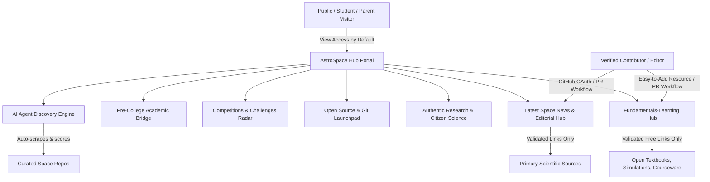
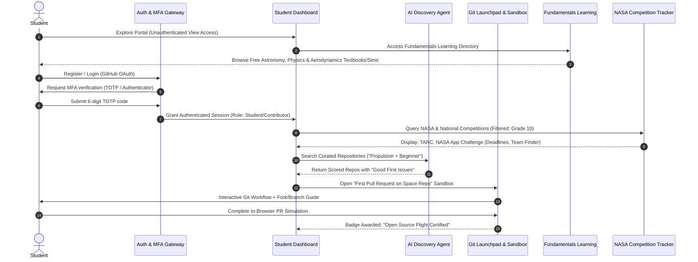
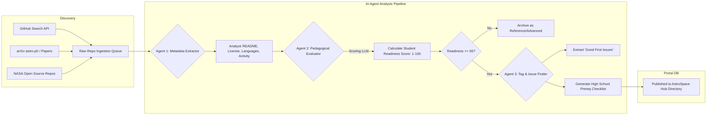
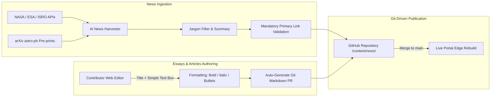
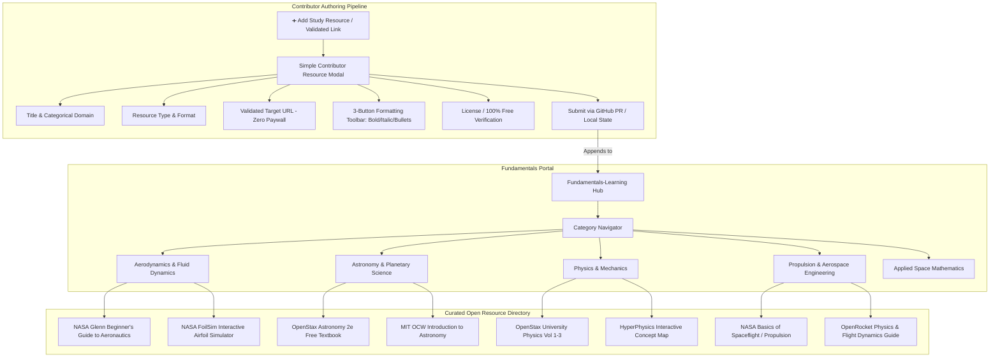
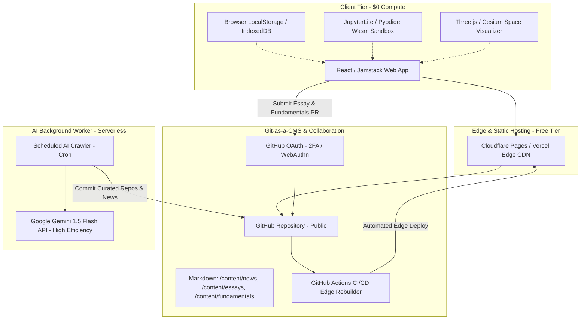
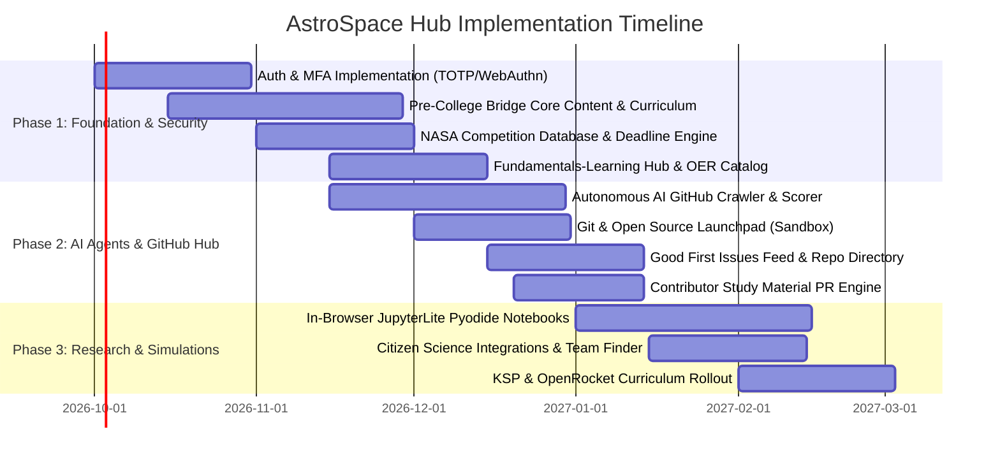

# Product Requirements Document (PRD)
## Project: AstroSpace Hub (Astronomy + Aerospace + Astrophysics Pre-College Portal)
**Target Audience:** High School Students (Grades 9–12 / Ages 14–18), Parent Mentors, STEM Educators, Space Enthusiasts & Contributors, Competition Coaches  
**Document Version:** 1.2.0  
**Status:** In Progress / Expanded with Fundamentals-Learning  

---

## 1. Executive Summary & Vision

### 1.1 Problem Statement
Space science education currently suffers from a bifurcated ecosystem:
1. **The Hobbyist / General Public Tier:** Informational and visually engaging (e.g., NASA image galleries, YouTube videos, enthusiast links), but lacking rigorous mathematics, computational skills, and structured progression toward university STEM.
2. **The University & Research Tier:** Advanced toolkits (e.g., Astropy, orbital mechanics simulations, aerospace fluid dynamics) that assume multivariable calculus, differential equations, and senior-level programming experience.

High school students aspiring to study Aerospace Engineering, Observational Astronomy, or Astrophysics have **no dedicated, unified bridge**. Existing open-source GitHub resources are fragmented across adult developer lists, research-level tools, or disjointed hobby blogs. Furthermore, students lack guidance on how to navigate and contribute to open-source space projects on GitHub, discover high-school-eligible NASA competitions, or access authentic citizen-science research datasets.

### 1.2 Vision & Value Proposition
**AstroSpace Hub** is the first unified, AI-curated, pre-college portal designed specifically to bridge high schoolers into collegiate aerospace engineering and astrophysics. 

#### Core Architectural Principles:
1. **"Nuclear-Active" Zero-PII Policy:** Personal Identifying Information is treated as hazardous waste. The portal collects and stores **zero PII** (no names, emails, addresses, phone numbers, or school names). This neutralizes liability and eliminates COPPA/FERPA compliance overhead.
2. **Ultra-Low Cost of Goods Sold (COGS):** Built on a serverless Jamstack edge architecture (Cloudflare Pages / Vercel), client-side WebAssembly computation (Pyodide), and Git-as-a-CMS, targeting an ongoing operating COGS of **< $15/month**.
3. **Open View Access by Default:** 100% public, transparent read access. Any student, parent, or educator can explore coursework, competitions, news, fundamentals study material, and run simulation labs without logging in.
4. **GitHub-Governed RBAC:** Content editing and authoring permissions are controlled directly through GitHub repository collaboration (collaborator permissions and Pull Requests), avoiding complex database-backed user management.
5. **Visual-First & Cognitive Ease:** Eliminates intimidating walls of academic prose. Information is chunked into **clickable visual cards**, descriptive titles, visual status badges, and interactive diagrams. The portal landing page features an authentic, panoramic Milky Way galactic core header over an observatory silhouette to inspire wonder.




---

## 2. Competitive Landscape & Gap Analysis

Existing curated GitHub repositories serve specific niches but fail high school students in distinct ways:

| Repository | Focus & Strengths | Limitations for High Schoolers | How AstroSpace Hub Bridges the Gap |
| :--- | :--- | :--- | :--- |
| [**`elburz/awesome-space`**](https://github.com/elburz/awesome-space) | Broad directory of NASA APIs, space agencies, general citizen science (Galaxy Zoo), media. | Curated for general hobbyists; lacks academic curricula, math prerequisites, and structured career pathways. | Adds structured academic pathways (AP/IB mapping) and connects hobby tools to mathematical fundamentals. |
| [**`HaralDev/Space-Systems-Engineering-Resources`**](https://github.com/HaralDev/Space-Systems-Engineering-Resources) | Free satellite design guides, orbital dynamics scripts, systems engineering. | Heavy undergraduate focus; assumes familiarity with matrices, state-space models, and formal engineering specs. | Provides "Pre-Calc to Orbital Mechanics" interactive scaffolding and annotated code explanations. |
| [**`jonathansick/awesome-astronomy`**](https://github.com/jonathansick/awesome-astronomy) & [**`mbiesiad/awesome-astronomy`**](https://github.com/mbiesiad/awesome-astronomy) | Gold-standard index of Astropy packages, FITS data handlers, and astrophysical research software. | Pure computational astrophysics targeting PhD/postdoc research; intimidating setup and jargon. | Extracts high-school-ready snippets (e.g., tracking ISS orbits, plotting exoplanet transit dips) with zero-install JupyterLite. |
| [**`mahran-sayed/awesome-aerospace-engineering`**](https://github.com/mahran-sayed/awesome-aerospace-engineering) | Detailed links for aeronautics, fluid mechanics, propulsion, and CFD. | Heavily theoretical; assumes Navier-Stokes equations, thermodynamic cycles, and university finite element software. | Translates propulsion and aerodynamics into high school physics concepts paired with model rocketry (OpenRocket) and Kerbal Space Program mechanics. |

> [!IMPORTANT]
> **Key Differentiator:** AstroSpace Hub does not simply compile static markdown links. It actively **evaluates repository difficulty**, provides **in-browser computation**, and pairs every repository with **educational prerequisites and beginner contribution guides**.

---

## 3. Core Personas

### Persona A: Leo (Grade 10 – The Aspiring Astronautical Engineer)
* **Background:** Taking AP Physics 1 and Algebra II/Trigonometry; loves Kerbal Space Program and model rocketry.
* **Pain Points:** Wants to participate in the American Rocketry Challenge (TARC) and build a flight computer, but finds Arduino flight control repos too advanced and poorly documented.
* **Goal in Hub:** Use OpenRocket integration, learn basic Python delta-$v$ calculations, access free aerodynamics study guides, and find high school rocketry mentors.

### Persona B: Maya (Grade 11 – The Data-Driven Astrophysicist)
* **Background:** Taking AP Calculus AB and AP Computer Science A; fascinated by exoplanets and black holes.
* **Pain Points:** Wants to do real science for the Regeneron ISEF / science fair, but does not know how to analyze raw telescope data or use Astropy without breaking environment setups.
* **Goal in Hub:** Complete an in-browser light-curve analysis project using Kepler/TESS data, read free college-bridge astronomy textbooks, and submit a pull request fixing documentation or adding test cases to an astronomy educational tool.

### Persona C: Dr. Bennett (High School Physics Teacher & Club Advisor)
* **Background:** Leads the school's Astronomy & Aerospace Club.
* **Pain Points:** Struggles to keep up with NASA competition deadlines, grant opportunities, and vetted resources appropriate for 14- to 18-year-olds.
* **Goal in Hub:** Track club participation in the NASA App Development Challenge, verify student submissions, utilize free open textbooks and simulation links in classroom lessons, and encourage students to contribute validated learning material.

### Persona D: David (Parent Mentor of a High Schooler)
* **Background:** Parent of a 10th-grade student fascinated by rocketry and astronomy; works in finance; has no formal engineering or astrophysics degree.
* **Pain Points:** Overwhelmed by complex college admission roadmaps (what coursework actually counts for top aerospace/astrophysics programs?), concerned about online safety and physical rocketry safety (NAR/TRA regulations), and struggles to find legitimate extracurriculars that are not predatory pay-to-play camps.
* **Goal in Hub:** Use the "Parent Mentor Dashboard" to track his teen's progress, verify safety protocols for competitions (TARC, local star parties), access non-technical breakdowns of coursework roadmaps (AP Physics vs. Calculus timing), and find zero-cost, high-yield learning resources.

### Persona E: Sarah (Space Enthusiast & Community Contributor)
* **Background:** Mid-career aerospace systems engineer (or amateur astrophotographer and open-source enthusiast with strong Python/C++ skills).
* **Pain Points:** Passionate about space science and wants to give back to high school education, but finds existing mentorship avenues rigid or lacking in curated open-source projects suitable for teenagers.
* **Goal in Hub:** Register as a verified "Community Contributor" to curate free aerodynamics/astronomy study links, create beginner-friendly Jupyter notebooks, flag "Good First Issues" on open-source space repos, conduct encouraging reviews on student mock PRs, submit monthly articles to the "Latest News" portal, and populate the "Fundamentals-Learning" repository.

---

## 4. User Journeys



---

## 5. Functional Requirements & Feature Specifications

### 5.1 Module 1: Security, "Nuclear-Active" Zero-PII Policy & GitHub-Governed RBAC

To guarantee maximum student privacy, eliminate legal liabilities, and maintain ultra-low operational COGS:

1. **Open View Access by Default:**
   * The entire website portal is **publicly readable without authentication**.
   * Any student, parent, educator, or enthusiast can read all guides, explore NASA competitions, view news summaries, access fundamentals study material, and execute in-browser Python notebooks immediately without registration.
2. **"Nuclear-Active" Zero-PII Guarantee:**
   * **Hazardous Data Classification:** Personal Identifying Information (PII) is treated as "nuclear-active" waste: under no circumstances does the application collect, process, or persist any PII.
   * **Zero PII in Storage:** The system maintains **no database fields** for Real Names, Email Addresses, Phone Numbers, Home Addresses, School Identifiers, or Dates of Birth.
   * **Anonymous Student Identity:** Students wishing to save bookmarks or lab progress use anonymized cryptographic tokens stored locally in their browser (`localStorage` / IndexedDB) or ephemeral pseudonym handles (e.g., `Cadet_Orion_42`).
   * **Compliance Immunity:** Because no PII is collected or stored, compliance risks under COPPA, FERPA, GDPR-K, and California Student Privacy laws are completely neutralized.
3. **Role-Based Access Control (RBAC) via GitHub Collaboration:**
   * Rather than building an expensive, brittle user database with custom permissions, all write/edit privileges are controlled directly through **GitHub repository access**:
     * **Public / Viewer (Default):** Unauthenticated, full view access across all portal resources.
     * **Community Contributor / Author:** Authenticated via GitHub OAuth (enforcing GitHub's mandatory 2FA). Can draft articles, submit beginner issues, propose news updates, or add validated learning resources using the portal's simple editor, which opens a GitHub Pull Request.
     * **Editor / Maintainer:** GitHub Repository Collaborators or Organization Members with `triage` or `write` permissions. Reviewing and merging a PR publishes the content to the live site via automated edge deployment.
4. **MFA Security for Contributors:**
   * Anyone with commit or publication authority must authenticate through GitHub with mandatory Multi-Factor Authentication (TOTP / WebAuthn FIDO2 Passkeys) enabled on their GitHub account.

---

### 5.2 Module 2: The Pre-College Bridge Knowledge Hub

Structured curriculum organizing Astronomy, Astrophysics, and Aerospace Engineering into high school fundamentals:

1. **Three Core Disciplines:**
   * **Astronomy (Observational & Stellar):**
     * Night sky navigation, coordinate systems (Right Ascension/Declination).
     * Optics, telescope configurations (Refractor vs. Reflector vs. Catadioptric), CCD imaging, filter bands ($UBVRI$).
     * Light pollution indices (Bortle scale) and astrophotography fundamentals.
   * **Astrophysics (Theoretical & Computational):**
     * Stellar evolution: The Hertzsprung-Russell (H-R) diagram, nuclear fusion cycles.
     * Gravitation & Keplerian orbits: Derivation from Newton's laws to orbital periods.
     * Spectroscopy & Doppler shift: Redshift, cosmological expansion, stellar chemical fingerprinting.
     * Black holes, neutron stars, and exoplanet detection methods (Transit Photometry, Radial Velocity).
   * **Aerospace Engineering (Atmospheric & Spaceflight):**
     * Fundamentals of aerodynamics: Lift, drag, Bernoulli's principle, airfoil geometry ($C_L, C_D$).
     * Rocket propulsion: Tsiolkovsky rocket equation, specific impulse ($I_{sp}$), propellant chemistry.
     * Astrodynamics: Hohmann transfer orbits, delta-$v$ ($\Delta v$) budgets, Lagrange points.
     * Satellite subsystems: Power (solar arrays), thermal control, ADCS (Attitude Determination and Control), communications.
2. **Academic Coursework & High School Roadmap:**
   * Recommended high school curricula mapped to goals:
     * *Aerospace Track:* AP Physics C (Mechanics), AP Calculus BC, AP Computer Science, CAD/Robotics electives.
     * *Astrophysics Track:* AP Physics C (Electricity & Magnetism + Mechanics), AP Calculus BC, Multivariable Calculus (if available), AP Chemistry.
   * Directory of summer programs: NASA OSTEM internships, MIT Beaver Works (BWSI), Summer Science Program (SSP), Clark Scholars.
3. **High School Research & Journals:**
   * Guide to publishing research before college:
     * *Journal of Emerging Investigators (JEI)*
     * *Young Scientists Journal*
     * *International Journal of High School Research (IJHSR)*
   * Instructions for writing academic abstracts, data citations, and scientific posters.

---

### 5.3 Module 3: Autonomous AI Agent Discovery Engine

An automated background worker pipeline that scours GitHub and scientific platforms to continually expand the portal’s curated index without overwhelming students with graduate-level code.



#### AI Agent Specifications:
1. **Crawler Schedule & Sources:**
   * Executes every 24 hours via scheduled cron jobs.
   * Queries:
     * GitHub Search API (`topic:astronomy`, `topic:astrophysics`, `topic:aerospace`, `topic:cubesat`, `topic:model-rocketry`, `topic:openrocket`, `topic:astropy`).
     * NASA open-source repository list (`nasa.github.io`).
     * arXiv recent papers with accompanying GitHub code (`astro-ph.IM` - Instrumentation and Methods for Astrophysics).
2. **Student Readiness Index (SRI) Algorithm (Score 0–100):**
   * **Documentation Clarity (30 pts):** Evaluates presence of setup instructions, plain-English explanations, and absence of jargon-heavy academic prose.
   * **Math/Theory Prerequisite Level (25 pts):** LLM evaluates if math requirements can be grasped with Algebra II / Pre-Calc / AP Physics, or if they require Tensor Calculus / Advanced PDE.
   * **Ease of Installation (20 pts):** Dockerized, `pip install`-able, or web-based repos score higher; complex C++/Fortran compilation scores lower.
   * **Community Health & Inclusivity (15 pts):** Presence of `CONTRIBUTING.md`, Code of Conduct, recent commit activity, response time on issues.
   * **Beginner Issue Density (10 pts):** Count of issues tagged `good first issue`, `help wanted`, or `documentation`.
3. **Automated Content Generation per Repository:**
   * Generates a 3-bullet **"Why This Matters for High Schoolers"** summary.
   * Outputs a **"Prerequisites Needed"** chip list (e.g., `Python Basics`, `Vectors`, `Newton's 2nd Law`).
   * Highlights 1–3 active **"Starter Tasks"** suitable for a high school student.
4. **Multi-Agent Evaluation Framework, Golden Dataset & CoT Traceability:**
   * **Evaluation Framework (Evals):** Automated CI/CD test harness running regression tests on every prompt or model upgrade against 6 core metrics: SRI Mean Absolute Error (MAE < 5 pts), Prerequisite Extraction F1 score (> 0.92), Faithfulness/Groundedness (> 0.98), Paywall Detection Recall (1.00 - zero false negatives), and Jailbreak Attack Success Rate (ASR < 0.1%).
   * **Golden Benchmark Dataset:** Standardized version-controlled test suite (`evals/data/golden_benchmarks.jsonl`) spanning curated edge cases: verified NASA/OpenStax OER, deceptive paywall traps, graduate-level math filters, prompt injection attempts, and student PII leak traps.
   * **Chain-of-Thought (CoT) Traceability:** Every agent execution generates transparent, auditable step-by-step reasoning logs (`chain_of_thought`) linked via OpenTelemetry trace contexts. Generated GitHub Pull Requests automatically embed an expandable `<details>` section containing the full verification trace for human maintainer review.

---

### 5.4 Module 4: Git & Open-Source Launchpad for High Schoolers

An interactive, scaffolded pathway connecting students directly to verified open-source space repositories on GitHub, complete with hyperlinked directories, repository tutorials, and an on-demand AI discovery refresh engine.

#### 1. On-Demand Repository Discovery & Real-Time Timestamp Engine
* **Interactive Refresh Controls (UI Specification):**
  * **Prominent Action Button:** `[ 🔄 Refresh Repositories ]` located at the top of the launchpad catalog.
  * **Tiny-Format Timestamp Badge:** Positioned adjacent to the button: `<span class="text-xs font-mono text-muted-foreground">🕒 Last refreshed: 2026-09-05 14:55:12 UTC</span>`.
* **Dynamic Search & Update Execution:**
  * When clicked by a student or contributor, the client dispatches a request triggering the AI Crawler / GitHub Search API:
    1. Scans GitHub across core topic queries: `topic:astronomy`, `topic:aerospace`, `topic:astrophysics`, `topic:cubesat`, `topic:model-rocketry`, `topic:openrocket`, `topic:astropy`.
    2. Discovers any newly created or trending space repositories, newly tagged `good first issue` tickets, and updated star counts.
    3. Runs the Student Readiness Index (SRI) scoring pipeline to assess documentation and math prerequisites.
    4. Appends verified repositories to the active view without requiring a full page reload.
    5. **Updates the timestamp** immediately to the current UTC timestamp in tiny format.
  * **Rate-Limiting Protection:** Includes a 60-second client-side cooldown (button displays `Refreshed (Cooldown 60s)`) to prevent GitHub API rate-limit exhaustion.

#### 2. Verified & Clickable Reference Repositories Directory
All major competing and foundational open-source space repositories are cataloged, validated, and directly hyperlinked:

| Project Repository | Core Domain | Focus & Strengths | High School Entry Point & Student Readiness |
| :--- | :--- | :--- | :--- |
| [**`elburz/awesome-space`**](https://github.com/elburz/awesome-space) | General Space & APIs | NASA APIs, space agencies, citizen science initiatives, media archives. | **Beginner (SRI: 92/100):** Markdown only; ideal for first-time link validation and catalog pruning. |
| [**`HaralDev/Space-Systems-Engineering-Resources`**](https://github.com/HaralDev/Space-Systems-Engineering-Resources) | Systems & Satellites | Satellite design guides, orbital dynamics scripts, plain-English aerospace explainers. | **Intermediate (SRI: 78/100):** Requires Algebra II and basic physics; excellent for CubeSat prep. |
| [**`jonathansick/awesome-astronomy`**](https://github.com/jonathansick/awesome-astronomy) | Observational Tools | Software packages for astronomers, FITS handlers, coordinate systems. | **Intermediate (SRI: 74/100):** Python basics; ideal for finding open data analysis packages. |
| [**`mbiesiad/awesome-astronomy`**](https://github.com/mbiesiad/awesome-astronomy) | Astronomical Data | Radio astronomy datasets, sky survey pipelines, reduction tools. | **Intermediate (SRI: 72/100):** Basic data science concepts; connects to real radio telescope data. |
| [**`mahran-sayed/awesome-aerospace-engineering`**](https://github.com/mahran-sayed/awesome-aerospace-engineering) | Aeronautics & Propulsion | Fluid mechanics, CFD, structural analysis, propulsion systems. | **Advanced (SRI: 65/100):** Physics C / Calculus; theoretical roadmap for future aero majors. |
| [**`astropy/astropy`**](https://github.com/astropy/astropy) | Computational Astrophysics | Community Python library for celestial coordinates, time, and physical units. | **Intermediate (SRI: 88/100):** Python fundamentals; rich documentation and friendly community. |
| [**`openrocket/openrocket`**](https://github.com/openrocket/openrocket) | Model Rocket Aerodynamics | Full 6-DOF trajectory simulator, stability ($CG/CP$), and motor thrust curves. | **Beginner-Friendly (SRI: 95/100):** Visual UI + Java backend; crucial for TARC rocketry teams. |
| [**`poliastro/poliastro`**](https://github.com/poliastro/poliastro) | Orbital Mechanics | Interactive Python package for interplanetary trajectories and orbit plotting. | **Intermediate (SRI: 82/100):** Newton's laws and Keplerian orbits; great visual orbits in Jupyter. |
| [**`nasa/cFS`**](https://github.com/nasa/cFS) | Flight Software | NASA Core Flight System used on real satellite and CubeSat missions. | **Advanced (SRI: 68/100):** C programming and embedded systems; gold standard for CubeSat software. |

---

### 5.5 Module 5: Competitions & Challenges Radar

A centralized directory of global and national high-school-eligible space competitions with live calendar tracking, prerequisite checklists, and team formation:

1. **Core Competitions Covered:**
   * **NASA App Development Challenge (ADC):** High school teams visualize Artemis Moon/Mars data using modern programming languages.
   * **American Rocketry Challenge (TARC):** World’s largest student rocket contest; design, build, and fly model rockets to precise altitudes and durations.
   * **Conrad Challenge (Aerospace & Aviation Category):** Entrepreneurial STEM competition creating commercially viable space tech.
   * **NASA Student Launch:** High-powered rocketry and scientific payload competition for advanced teams.
   * **NASA CubeSat Launch Initiative (CSLI):** High school proposals to build and deploy 1U–3U CubeSats on real launches.
   * **NASA International Space Apps Challenge:** Global 48-hour virtual hackathon solving space and Earth challenges.
   * **Genes in Space:** High schoolers design DNA experiments to be performed aboard the International Space Station (ISS).
2. **Feature Requirements:**
   * **Dynamic Countdown & Deadline Alerts:** Automated notifications 30/14/7 days before registration and submission deadlines.
   * **Eligibility Filter:** Filter by grade level (9–12), team size, cost to enter, and US-only vs. International.
   * **Team Formation Board:** Safe, moderated forum where verified students can post their skills (e.g., "Python/Astropy programmer seeking CAD/rocketry hardware teammate for Conrad Challenge").
   * **Winning Past Projects Archive:** Post-mortems, sample engineering notebooks, and winning presentations from previous competition years.

---

### 5.6 Module 6: Citizen Science & Authentic Research Lab

Connecting students to legitimate scientific discovery pipelines using real observational data:

1. **Curated Citizen Science Platforms:**
   * **Zooniverse - Planet Hunters TESS:** Classify real light curves from NASA’s TESS spacecraft to discover candidate exoplanets.
   * **Zooniverse - Galaxy Zoo:** Morphological classification of distant galaxies imaged by Hubble and James Webb Space Telescope (JWST).
   * **Radio JOVE (NASA):** Monitor decametric radio emissions from Jupiter’s magnetosphere and the Sun using accessible radio kits.
   * **Pulsar Search Collaboratory (PSC):** Discover new pulsars using Green Bank Telescope radio data; gives high schoolers direct co-authorship on discovery papers.
2. **The Research Project Incubation Guide:**
   * How to frame a research hypothesis from public astronomical data (Kepler, SDSS, Gaia archive).
   * Standard scientific paper templates formatted for high school science fairs (ISEF, STS) and journals.

---

### 5.7 Module 7: Interactive Simulations & Lab Sandbox

Directly integrated browser simulations that connect theory to visual experimentation:

1. **Orbital & Astrodynamic Simulators:**
   * **NASA’s Eyes on the Solar System / Exoplanets:** WebGL-embedded views of real-time spacecraft trajectories, asteroid paths, and planetary systems.
   * **Stellarium Web:** Embedded sky map for planning real-world observation sessions, tracking satellite passes, and recognizing constellations.
2. **Engineering & Flight Modeling:**
   * **OpenRocket Sandbox Guide:** Step-by-step tutorials on aerodynamic stability, center of gravity ($CG$) vs. center of pressure ($CP$), and motor thrust curves ($C_6-5$ through $F$ motors).
   * **Kerbal Space Program (KSP) Academic Curriculum:** Curated mission challenges (e.g., "Achieve circular orbit at 100km using under 4,500 m/s $\Delta v$", "Docking in Orbit", "Hohmann Transfer to Duna") with accompanying physics worksheets calculating theoretical vs. actual fuel consumption.

---

### 5.8 Module 8: Introductory Computational Notebooks (In-Browser JupyterLite)

Zero-installation, browser-based Jupyter environments running on WebAssembly (Pyodide):

1. **Pre-Built Interactive Notebooks:**
   * **Lab 01: Tracking the ISS in Real-Time:** Query the open ISS telemetry API, compute current lat/long, and project ground tracks on a 3D Earth model using `geopandas` and `folium`.
   * **Lab 02: The Rocket Equation in Action:** Simulate multistage rocket launches by varying payload mass, structural ratio, and exhaust velocity using the Tsiolkovsky equation.
   * **Lab 03: Detecting an Exoplanet Transit:** Load a synthetic or real TESS photometric light curve, apply a box-least-squares (BLS) periodogram, and calculate planet radius relative to star radius ($\Delta F = (R_p / R_*)^2$).
   * **Lab 04: Mapping the Stars with Gaia:** Query the European Space Agency (ESA) Gaia DR3 archive via Astropy/Astroquery, plot parallax vs. distance, and construct an empirical H-R diagram.

---

### 5.9 Module 9: 'Latest Space News', Editorial Hub & Multimedia Radar

A dedicated navigation hub providing real-time, monthly curated updates, scientific findings, multimedia channels, and a frictionless authoring system for community contributors.



#### 1. News Summaries & Strict Credible Source Validation
* **Concise News Summaries:** Each news card features a 2-to-3 sentence executive summary explaining the discovery or event in plain English with high-school-accessible context.
* **Strict Original Link Mandate:**
  * Every news item **must link directly to a validated, credible original primary source**.
  * **Automated Whitelist Enforcer:** Submissions or AI-harvested stories are validated against an approved primary-source domain list:
    * Space Agencies: `nasa.gov`, `esa.int`, `jaxa.jp`, `isro.gov.in`, `cnsa.gov.cn`
    * Pre-Print Repositories: `arxiv.org` (specifically `astro-ph`, `physics.space-ph`)
    * Peer-Reviewed Journals: `nature.com`, `science.org`, `iopscience.iop.org`, `aanda.org`
    * Verified Aerospace Flight Telemetry: `spaceflightnow.com`, `nasaspaceflight.com`
  * Secondary re-bloggers, clickbait aggregators, and unverified social media claims are strictly filtered out.

#### 2. Articles & Essays Creator (Minimalist, Low-Friction Authoring)
* **Goal:** Make adding new articles, tutorials, project updates, and editorial essays as simple and frictionless as possible for enthusiasts, mentors, and student researchers.
* **Minimalist Authoring Interface:**
  * **Simple Title Field:** Clean, single-line text input for the headline.
  * **Text Box with 3-Button Formatting Toolbar:**
    * **Bold Button (`**bold**`):** Highlights key terms and takeaways.
    * **Italic Button (`*italic*`):** Denotes spacecraft names, Latin astronomical designations, and variables.
    * **Bullets Button (`- bullet`):** Quickly creates clean list items, milestones, or equipment lists.
  * **Live Markdown Preview:** Instant split-screen or toggle preview showing the formatted essay.
* **Zero-COGS Git Publishing Workflow:**
  * When the author clicks **"Submit Essay"**:
    1. The portal packages the text and frontmatter metadata into a standardized Markdown file (`content/essays/YYYY-MM-DD-slug.md`).
    2. Uses the GitHub REST API (Octokit) with the contributor's GitHub OAuth token.
    3. If the user has direct collaborator access: Commits directly to `main`.
    4. If the user is an open-source contributor: Automatically forks the repo and opens a GitHub Pull Request.
    5. Maintainers review the PR on GitHub and click "Merge", triggering an automated 10-second edge rebuild.

---

### 5.10 Module 10: Visual-First Navigation, Clickable Cards & Milky Way Hero Architecture

To make space science frictionless and engaging for 14- to 18-year-olds, the user interface follows a strict **"Visual-First, Low-Cognitive-Load"** design philosophy:

#### 1. The Panoramic Milky Way Hero Header
* **Cinematic Header Banner:** Displays a full-bleed panoramic astrophotograph of the Milky Way galactic core arching over a silhouetted mountaintop observatory.
* **Atmospheric Gradient:** Soft bottom-fade transitioning from deep space indigo (`#050814`) to obsidian black (`#0b0d17`) to ensure readable section transitions.

#### 2. Clickable Visual Card Design System (Replacing Dense Text)
Rather than long reading lists or markdown bullet walls, every resource is converted into an interactive visual card:
* Visual Thumbnail (16:9 / 4:3) with high-definition space imagery.
* Bold Punchy Title (limited to 4–6 words).
* Prerequisite & Difficulty Badges (`Beginner`, `Intermediate`, `Advanced`).
* Two-Sentence Benefit-Driven Teaser.
* Interactive Hover States (`scale-102`, border glow, and visual depth lift).

---

### 5.11 Module 11: Fundamentals-Learning Hub (Free Educational Resources & Contributor Study Material)



#### 1. Core Objective & Pedagogical Mission
The **Fundamentals-Learning Hub** solves the "paywall & fragmentation" barrier for high school students by curating a structured, comprehensive directory of **100% free, high-yield open educational resources (OER), textbooks, interactive visualizers, simulation webpages, and study material** covering the core academic foundations:
* **Aerodynamics & Fluid Dynamics:** Lift/drag generation, Bernoulli's principle, airfoil geometry, boundary layer theory, subsonic/supersonic flow, and wind tunnel fundamentals.
* **Observational & Stellar Astronomy:** Celestial sphere coordinates (RA/Dec), optics and telescope designs, photometry, stellar evolution, and deep-sky observation.
* **Classical & Modern Physics:** Newton's laws of motion, gravitation, work-energy theorem, thermodynamics, wave optics, electromagnetism, and special relativity fundamentals.
* **Aerospace Engineering & Rocket Propulsion:** Tsiolkovsky rocket equation, specific impulse ($I_{sp}$), propellant chemistry, nozzle mechanics (de Laval nozzles), and orbital maneuvering.
* **Applied Space Mathematics:** Trigonometry, calculus foundations, vector mathematics, and numerical trajectory integration.

#### 2. Strict Quality & Accessibility Standards
* **100% Zero-Paywall Policy:** No paid courses, no subscription gates, no "free trial then credit card" tricks. Every link must point to permanently free, legally open-access, or public-domain educational material.
* **High School Pedagogical Scaffolding:** Advanced college materials must include prerequisite indicators and suggested reading order so students are not demoralized by sudden multivariable calculus or advanced tensor notation.
* **Verified Reputable Domains:** All curated links originate from reputable institutional repositories, including NASA (`nasa.gov`), ESA (`esa.int`), OpenStax (`openstax.org`), MIT OpenCourseWare (`ocw.mit.edu`), academic universities (`.edu`), and established non-profit science institutions.

#### 3. Contributor "Easy-to-Add" Button & Frictionless Publishing Flow
Mirroring the successful 3-button authoring paradigm on the **Latest News** page, the Fundamentals-Learning section features an accessible, user-friendly contribution engine:

* **Prominent Header Action Button:**
  * Displays a glowing, high-contrast action button: `[ ➕ Add Study Resource / Validated Link ]`.
  * Positioned adjacent to the category filter chips for immediate visibility.
* **Zero-Friction Modal Authoring Interface:**
  * **Resource Title:** Clean text input for the name of the resource (e.g., *"NASA Glenn Beginner's Guide to Aeronautics"*).
  * **Discipline Category Dropdown:** 
    * `Aerodynamics & Fluid Dynamics`
    * `Astronomy & Astrophysics`
    * `Physics & Classical Mechanics`
    * `Aerospace Engineering & Propulsion`
    * `Applied Mathematics for Space`
  * **Resource Type Selector:**
    * `Free Online Textbook (OER)`
    * `Interactive Simulation / Webtool`
    * `Full Video Course / Lecture Series`
    * `Study Guide / Cheatsheet (PDF)`
    * `Guided Problem Set & Solutions`
  * **Validated Target URL:** URL input with automatic HTTPS protocol enforcement and domain validation.
  * **Difficulty / Prerequisite Level:**
    * `Beginner (Grades 9–10 / Algebra I)`
    * `Intermediate (Grades 11–12 / AP Physics & Calc)`
    * `Advanced (College Bridge / Dual Enrollment)`
  * **Study Material Description & Key Takeaways:**
    * Textarea equipped with the signature **3-Button Formatting Toolbar** (`Bold`, `Italic`, `Bullets`) allowing contributors to format key physics formulas, prerequisites, or chapter recommendations without needing complex Markdown knowledge.
  * **Mandatory Free/OER Affirmation Checkbox:**
    * *"I confirm this resource is 100% free, unpaywalled, legally accessible to students worldwide, and safe for pre-college learners."*
* **Git-Driven Publishing Protocol:**
  * Clicking **"Submit Study Resource"**:
    1. Instantly compiles the resource into standardized Git Markdown frontmatter (`content/fundamentals/YYYY-MM-DD-slug.md`).
    2. Dispatches a GitHub Pull Request via the contributor's authenticated session (or appends to client state with immediate visual confirmation).
    3. Displays an immediate success notification: *"Resource validated and submitted to repository review queue!"*

#### 4. Pre-Populated Foundation Catalog
The section launches with an initial suite of vetted, authoritative resources:

| Resource Title | Core Category | Type | Provider / Source | Difficulty Level | Validated URL |
| :--- | :--- | :--- | :--- | :--- | :--- |
| **NASA Beginner's Guide to Aeronautics** | Aerodynamics | Interactive Webpage & Guides | NASA Glenn Research Center | Beginner to Intermediate | `https://www.grc.nasa.gov/www/k-12/airplane/bga.html` |
| **NASA FoilSim Interactive Airfoil Simulator** | Aerodynamics | Browser Simulation Tool | NASA Glenn Educational Labs | Beginner | `https://www.grc.nasa.gov/www/k-12/airplane/foil3.html` |
| **OpenStax Astronomy 2e** | Astronomy | Peer-Reviewed Open Textbook | OpenStax / Rice University | Beginner to Intermediate | `https://openstax.org/details/books/astronomy-2e` |
| **MIT OCW Introduction to Astronomy** | Astronomy | Courseware & Lecture Notes | MIT OpenCourseWare (8.282J) | Intermediate | `https://ocw.mit.edu/courses/8-282j-introduction-to-astronomy-spring-2006/` |
| **OpenStax University Physics Vol 1 & 2** | Physics | Peer-Reviewed Open Textbook | OpenStax / Rice University | Intermediate (AP Physics C) | `https://openstax.org/details/books/university-physics-volume-1` |
| **HyperPhysics Mechanics & Astrophysics** | Physics | Interactive Concept Mind-Map | Georgia State University | Beginner to Intermediate | `http://hyperphysics.phy-astr.gsu.edu/hbase/hframe.html` |
| **NASA Basics of Space Flight** | Aerospace Engineering | Comprehensive Online Manual | NASA Jet Propulsion Laboratory (JPL) | Intermediate | `https://science.nasa.gov/learn/basics-of-space-flight/` |
| **OpenRocket Flight Dynamics & Physics Documentation** | Aerospace & Aerodynamics | Technical Guide & Model Rocket Sim | OpenRocket Open Source Project | Intermediate | `https://openrocket.info/documentation.html` |
| **Paul's Online Math Notes (Calculus & Vectors)** | Applied Mathematics | Open Tutorial & Problem Library | Lamar University | Intermediate to Advanced | `https://tutorial.math.lamar.edu/` |

---

## 6. Technical Architecture & Ultra-Low COGS Stack



### 6.1 Ultra-Low COGS Tech Stack Specification
* **Hosting & Edge Delivery:** Cloudflare Pages or Vercel (Hobby/Pro free/low tier) — **$0 to $5/month**. Delivers static HTML/JS globally at sub-second speeds.
* **Content Storage (Git-as-a-CMS):** All news, essays, fundamentals study guides, and repo catalogs are stored as plain Markdown/MDX files in the public GitHub repository. **Cost: $0/month**.
* **Zero Server-Side Python Execution:** All computational notebooks run client-side in the student's browser via WebAssembly (Pyodide / JupyterLite). **Server Compute Cost: $0/month**.
* **Authentication & RBAC:** Handled directly by GitHub OAuth and repository permissions. No custom user databases, no credential hashing servers. **Cost: $0/month**.
* **AI Ingestion Pipeline:** Runs on free GitHub Actions cron or lightweight serverless function invoking Gemini 1.5 Flash (extremely cost-efficient token pricing). **Estimated Cost: < $5/month**.
* **Total Estimated System COGS:** **< $10 to $15 / month total operating cost**, capable of serving 100,000+ monthly active students.

---

## 7. Data Models & Git-Backed Content Schemas

### 7.1 Git-Backed Content Schemas (Stored in GitHub Repository)

#### News Item Schema (`content/news/YYYY-MM-DD-slug.md`)
```yaml
---
id: "news-2026-10-01-k2-18b"
title: "JWST Confirms Atmospheric Carbon Dioxide and Methane on Exoplanet K2-18b"
date: "2026-10-01"
category: "Astrophysics"
summary_tldr: "James Webb Space Telescope spectroscopy reveals carbon-bearing molecules in the habitable-zone exoplanet K2-18b, suggesting a possible Hycean ocean world."
high_school_math_concept: "Transmission Spectroscopy (Snell's Law and Absorption Dip Ratios ΔF = (Rp/R*)^2)"
validated_primary_source_url: "https://science.nasa.gov/missions/webb/webb-discovers-methane-carbon-dioxide-in-atmosphere-of-k2-18b/"
validated_source_publisher: "NASA / ESA Science Directorate"
video_embed_url: "https://www.youtube-nocookie.com/embed/example-jwst"
tags: ["JWST", "Exoplanets", "Spectroscopy"]
---
```

#### Fundamentals Study Material & Validated Link Schema (`content/fundamentals/YYYY-MM-DD-slug.md`)
```yaml
---
id: "fund-2026-10-20-nasa-aero"
title: "NASA Glenn Beginner's Guide to Aeronautics"
category: "Aerodynamics & Fluid Dynamics"
resource_type: "Interactive Webpage & Guides"
target_url: "https://www.grc.nasa.gov/www/k-12/airplane/bga.html"
publisher_or_institution: "NASA Glenn Research Center"
difficulty_level: "Beginner (Grades 9-10 / Algebra I)"
is_free_verified: true
submitted_by_handle: "flight_mentor_dan"
tags: ["Aerodynamics", "Airfoils", "Bernoulli", "NASA OER"]
---

### Course Description & Key Concepts
The NASA Glenn Beginner's Guide covers core aeronautical principles:
- **Newton's Laws vs. Bernoulli:** Why both models are essential for understanding airfoil lift.
- **The Four Forces of Flight:** Interactive calculations for Weight, Lift, Thrust, and Drag.
- **Mach Numbers:** Subsonic ($M < 0.8$), Transonic ($0.8 < M < 1.2$), and Supersonic ($M > 1.2$) flight regimes.
```

#### Community Essay & Article Schema (`content/essays/YYYY-MM-DD-slug.md`)
```yaml
---
id: "essay-2026-10-15-amateur-radio-jove"
title: "Listening to Jupiter: Building a Decametric Radio Telescope for Under $100"
date: "2026-10-15"
author_github_handle: "astro_sarah"
author_role: "Community Contributor"
tags: ["Radio Astronomy", "DIY Hardware", "Radio JOVE"]
---

### Introduction
You don't need a multi-million-dollar dish to hear the cosmos. With a simple dipole antenna and an SDR receiver, you can capture decametric radio bursts caused by Io orbiting through Jupiter's magnetic field...
```

---

## 8. Non-Functional Requirements (NFRs)

### 8.1 Security & "Nuclear-Active" Zero-PII Policy
* **Zero PII Footprint:** Under zero circumstances will any student or visitor PII (names, emails, phones, schools, locations) be collected or retained in backend databases.
* **Zero-Trust Contributor MFA:** All repository maintainers and authors publishing content or validated study links must have Multi-Factor Authentication (TOTP / WebAuthn) enforced via GitHub.
* **Domain Whitelisting for News & Study Links:** Automated CI/CD linting rejects any resource submission that does not link to an approved institutional or open-access domain or that contains paywalled content.
* **COPPA/FERPA Exemption via Architecture:** Because zero personal data is gathered, the platform operates outside the risk surface of student data privacy breaches.

### 8.2 Ultra-Low COGS & Performance Targets
* **Infrastructure COGS Cap:** Total operating costs across CDN, hosting, domain, and AI background scrapers must remain strictly **under $20.00/month**.
* **Zero Server Compute Execution Risk:** 100% of student Python notebooks execute inside client-side WebAssembly (Pyodide), completely eliminating remote code execution (RCE) server risks and zeroing server compute bills.
* **Global Edge Performance:** Page load time (LCP) under **1.2 seconds** worldwide via Cloudflare Pages / Vercel Edge caching.
* **Availability SLA:** 99.9% uptime with zero single points of failure (static failover).

### 8.3 Accessibility (a11y)
* Full compliance with **WCAG 2.1 AA** standards.
* Screen-reader accessible cards, contrast-optimized night-mode.
* Full keyboard navigation across all interactive forms, modal editors, and study category tabs.

---

## 9. Phased Implementation Roadmap



---

## 10. Key Performance Indicators (KPIs) & Success Metrics

1. **Student Engagement & Learning:**
   * 10,000+ monthly active high school students within 6 months of launch.
   * 50,000+ views of free OER textbooks, simulation tools, and study guides in the Fundamentals-Learning Hub.
2. **Open-Source & Contributor Impact:**
   * 1,000+ verified first-time GitHub pull requests submitted by high schoolers to public space repositories.
   * 100+ community-submitted and peer-reviewed free study resources and guides cataloged in Fundamentals-Learning.
3. **Competition & Research Outcomes:**
   * 200+ student teams formed through the portal for competitions (NASA ADC, TARC, Conrad).
   * At least 50 student research submissions using the citizen science data pipelines to high school or international science fairs (ISEF, STS, JEI).

---

## 11. Open Questions & Future Considerations

> [!TIP]
> **Questions for Stakeholder Review:**
> 1. **MFA Enforcement Policy:** Should MFA be strictly mandatory for all student accounts upon creation, or should it be optional during exploratory onboarding, becoming mandatory once they interact with team formation, submit PR links, or contribute study resources?
> 2. **Automated Link Liveness Checker:** Should an automated GitHub Action run weekly to ping all curated URLs in Fundamentals-Learning and flag any 404 dead links automatically?
> 3. **Interactive Study Quiz Widgets:** Should high school teachers have the ability to embed quick self-assessment conceptual quizzes directly beneath each fundamental study module?
